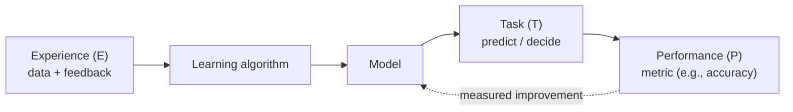
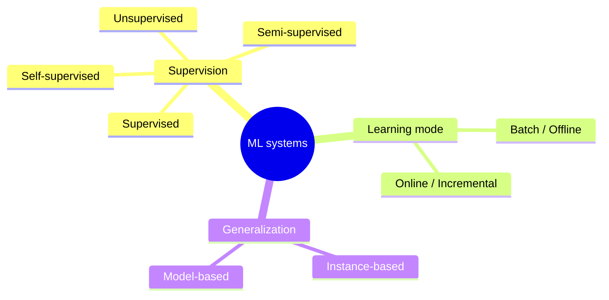
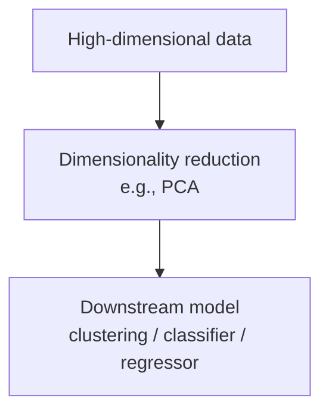
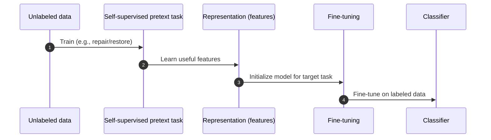
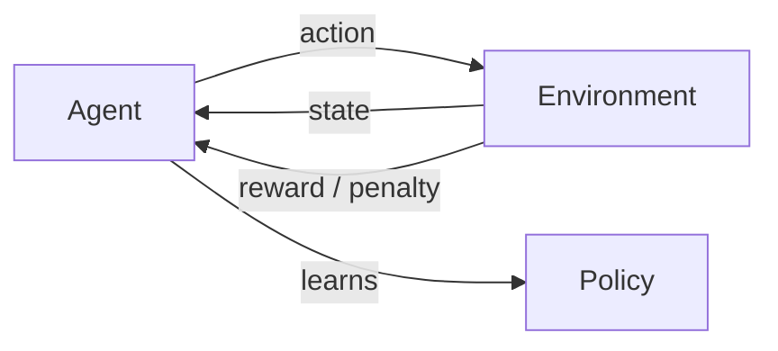
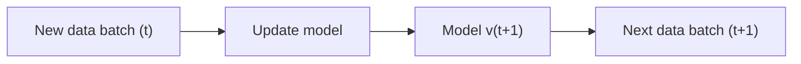

> [!quote] One-line definition
> **Machine Learning** is the science (and art) of programming computers so they can **learn from data**.

---

## The canonical definition (Tom Mitchell)
> [!abstract] Mitchell’s formulation
> A program learns from **experience** $E$, with respect to **task** $T$ and **performance measure** $P$, if its performance on $T$ (as measured by $P$) improves with $E$.

---

## Glossary (must-know terms)
> [!info] Vocabulary
> - **Training set** → data used to learn  
> - **Instance / Sample** → one example/row  
> - **Model** → component that learns patterns & predicts (e.g., neural nets, random forests)  
> - **Accuracy** → fraction of correct predictions (common for classification)

---

## Why ML? (When it’s a good fit)
- Replaces **brittle rule-based systems** (shorter code, often better performance)
- Tackles **complex problems** where handcrafted solutions fail
- Handles **fluctuating environments** via retraining
- Enables **data mining** (discovering hidden patterns/insights)

> [!example] Historical anchor
> The first mainstream ML success: **spam filters** (1990s).

---

## A simple taxonomy of ML systems

---

## 1) Supervised learning
> [!success] Key idea
> Learn from **labeled** examples: $(x \rightarrow y)$.

- **Regression** → predict a **number** (e.g., house price)
- **Classification** → predict a **category** (e.g., spam vs ham)

> [!note] Boundary-crossing
> Some models can serve both. **Logistic regression** is used for classification and can output **probabilities**.

---

## 2) Unsupervised learning
> [!success] Key idea
> Learn structure from **unlabeled** data: only $x$.

### Common tasks
- **Clustering** → group similar instances
- **Dimensionality reduction** → compress data while preserving information
- **Feature extraction** → merge correlated features  
  - Example: mileage + age → **“wear & tear”**
- **Anomaly detection** → detect unusual patterns (trained mostly on “normal” data)
- **Novelty vs anomaly**  
  - Rare-but-expected cases may be **novel** rather than **anomalous** depending on the goal
- **Association rule learning** → find co-occurrence patterns  
  - Example: BBQ sauce + chips → steak

**Common workflow:** reduce dimensions before feeding data to another algorithm.

---

## 3) Self-supervised learning (unlabeled → labeled)
> [!success] Key idea
> Create supervision from **unlabeled** data (pseudo-labels), then train like supervised learning.

### Example (from the book)
- Train an **image-repair** model on unlabeled pet photos (mask part of image → predict missing part)
- The model learns strong representations (cats ≠ dogs)
- Then adapt the model to **classify species** and **fine-tune** with a smaller labeled set

### Transfer learning (connected concept)
> [!note] Transfer learning
> Reuse knowledge learned on one task/domain to boost performance on another (often via **fine-tuning**).

---

## 4) Reinforcement learning
> [!success] Key idea
> An **agent** learns a **policy** by interacting with an **environment** and maximizing reward.

---

## Batch vs Online learning
### Batch learning (Offline)
> [!warning] Batch learning
> - Train on **all available data** at once  
> - After deployment: **no more learning** (offline inference)
>
> Risk: **data drift / model rot** → performance decays as the world changes.

### Online learning (Incremental)
- Update the model **continuously** (or in small steps)
- Best for **streaming data** and **dynamic environments**

---

## Quick recap
> [!summary] Chapter 1 in 6 bullets
> - ML learns from **data** to improve performance on a **task**.
> - Mitchell’s triad: **$E$ (experience), $T$ (task), $P$ (performance)**.
> - Supervised = **labeled**; unsupervised = **unlabeled**.
> - Self-supervised generates labels to enable supervised learning.
> - RL learns via **interaction + reward** (policy learning).
> - Monitor for **data drift**; choose **batch vs online** based on change rate & data flow.
